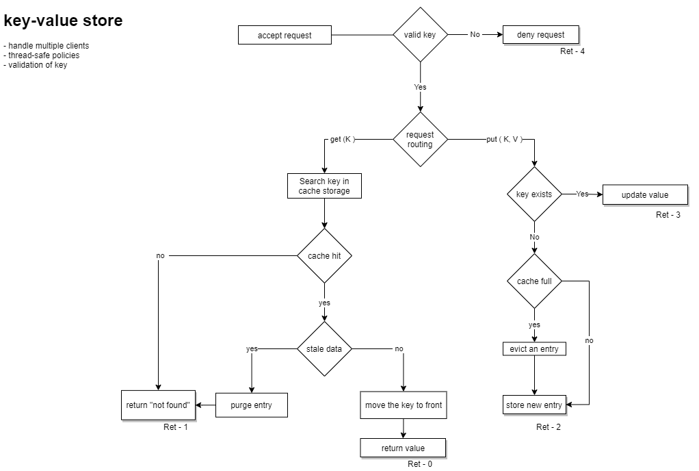

# Simple Key-Value Store



### Features

- multithreaded (using Oat++ simple API).
- thread safe ( uses reader-writer pattern )
- supports multiple clients
- REST server
- validates key (keys with spaces are invalid)

### TODO

- make it exception safe ( make the changes transactional )
- add docker and swagger support
- handle server errors better
- improve cache implementation by implementing e.g. utf support, probabilistic DS like bloom filters, scaling options

### Project layout

```
.
├── CMakeLists.txt          // projects CMakeLists.txt
├── conanfile.txt           // third party dependencies
├── src
│   ├── cache               // LRU Cache Implementation
│   ├── controller          // CacheController
│   ├── dto                 // DTOs for req and res
│   └── server              // main() and server config
└── test                    // test folder
```

---

### Build and Run

- install cmake, make, gcc from your distro package manager.
- install [conan](https://www.conan.io) from pip.
- create your default conan profile. ignore if already exists.
 
```
$ conan profile new default --detect  # Generates default profile detecting GCC and sets old ABI
$ conan profile update settings.compiler.libcxx=libstdc++11 default  # Sets libcxx to C++11 ABI
```

- install [Oat++(AKA oatpp)](https://oatpp.io/) third party dependency using conan package manager, from build directory. These dependencies are mentioned in `conanfile.txt`.

```
$ mkdir build && cd build
$ conan install .. --remote=conancenter --build=missing -s compiler=gcc -s compiler.version=11 -s compiler.cppstd=17 -s build_type=Debug -s compiler.libcxx=libstdc++11
```

- build and run the application using cmake.
 
```
$ cmake .. -G "Ninja" -DCMAKE_BUILD_TYPE=Debug -DCMAKE_C_COMPILER=gcc -DCMAKE_CXX_COMPILER=g++
$ cmake --build .
$ ./bin/kv_store-exe         #run application
```

- install [postman](https://www.postman.com/) and import `postman.api_tests.json` and run tests.


### API

**Request**

http verb|url|body
---|---|---
GET|localhost:8000/cache?key=<key_to_find>| no body
PUT|localhost:8000/cache|{ "key" : "foo", "value" : "bar" }

**Response**

http verb|response body
---|---
PUT|{ "statusCode": 2 }
GET|{ "statusCode": 0, "value": "bar" }


*status code in response body*

```
FOUND    = 0, // requested value for a key found
NOTFOUND = 1, // key does not exist
NEW      = 2, // new entry added in cache
UPDATE,  = 3  // value updated
INVALID, = 4  // invalid request, request denied/dropped ( could be some 4xx )
ERROR    = 5  // internal server error ( could be 5xx )
```

### NOTE

It's based on the [oatpp-starter project](https://github.com/oatpp/oatpp-starter).

